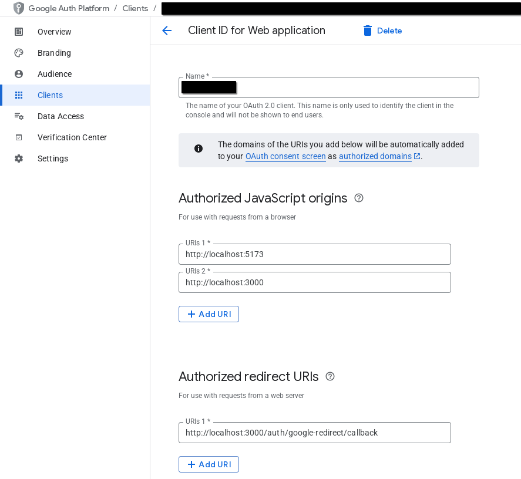

### Setup necessary

Beyond the usual npm i in both the client and server folders in order to grab the node_modules, you'll need to create a client in the Google cloud console to grab the ID associated with your app. You can read more here :https://developers.google.com/identity/sign-in/web/sign-in

You'll also need to authorize both the client and server URLs in "Authorized JavaScript origins", as well as the /auth/google-redirect/callback endpoint of the server in "Authorized redirect URIs" in the Google Auth Platform => Clients => (your project client) like so:



After that, the client expects a .env file like:

```
VITE_GOOGLE_CLIENT_ID="" <- Your Google client ID as provided in the Google Cloud console
VITE_DOMAIN_URL="" <- The backend URL. http://localhost:3000 by default
```

While the server expects one like:

```
GOOGLE_CLIENT_ID="" <- Google client ID, same as the one above
GOOGLE_CLIENT_SECRET="" <- Google secret corresponding to the client ID
CLIENT_URL="" <-- The frontend URL, Vite defaults this to http://localhost:5173
SERVER_URL="" <-- The backend URL, defaulted to http://localhost:3000
```

